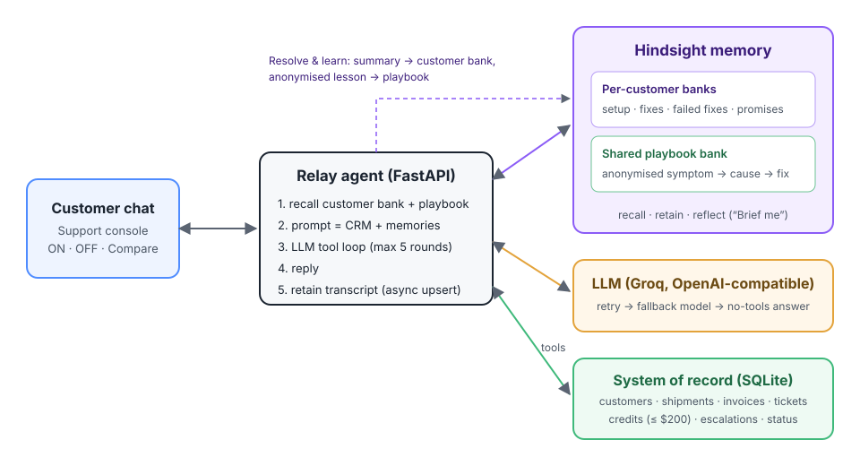

# Relay: a customer support agent that remembers

**Relay** is the support agent for *ShipRelay*, a (fictional) shipping and fulfilment platform used by online merchants. It answers customers in chat, checks shipments and invoices, opens tickets, issues credits and escalates.


Most support bots are stateless. They know the CRM record, so they know your plan. They don't know that your Zebra printer went blank last spring because a firmware update reset it to 203 dpi, that the first rep made you reinstall the Print Agent for nothing, or that we promised your account manager would be copied the next time FedEx rates broke. Relay knows these things because every conversation is written to [Hindsight](https://github.com/vectorize-io/hindsight) agent memory and recalled before each reply.

It also learns across customers. When a case is resolved, the anonymised lesson (symptom → root cause → fix that worked → fix that didn't) goes into a shared **playbook** bank. The next merchant with the same problem gets the right fix in the first message.



## What memory changes (same model, same prompt, same tools)

These are the seeded scenarios and the behaviour the agent is designed to produce. Exact wording varies from run to run.

| Customer says | Without memory (CRM only) | With Hindsight memory |
|---|---|---|
| Priya (bakery): *"Labels are printing blank again, it's Diwali week"* | "Try restarting the printer and reinstalling the Print Agent." That is the exact step that cost her 2 hours last time. | Recalls T-4471: Zebra ZD421 firmware reset to 203 dpi. Gives her the 3-click DPI fix, says it won't make her reinstall, and acknowledges the rush. |
| Elena (Enterprise): *"FedEx rates timing out AGAIN for Reno"* | Asks troubleshooting questions. | Knows it's the 3rd time this quarter, that Dana (AM) promised an immediate human escalation with her copied, and that the rate cache on Reno was the cause once. Checks service status, escalates P1 and copies Dana. |
| Rahul (new customer, 3 weeks old): *"Labels blank since the printer updated overnight"* | Generic printer troubleshooting. | No personal history, but the **playbook** has Priya's anonymised resolution, so he gets the 203 dpi fix on the first reply. |
| Tom (non-technical): *"Import says invalid header again"* | Explains CSV encodings. | Remembers it was Mac Excel saving UTF-16 and walks him through *File › Save As › CSV UTF-8*, one step at a time, which is how he asked to be helped. |

The ui has a **Compare** mode that sends the same message to both agents side by side. That makes the before/after visible within seconds.

## How Hindsight is used

| Hindsight call | Where | Why |
|---|---|---|
| `create_bank` with `retain_mission` / `reflect_mission` | `app/memory.py` | One bank per customer (`shiprelay-customer-c1001`) plus a shared `shiprelay-playbook`. Missions steer extraction toward the environment, root causes, failed fixes, promises and preferences, and keep names out of the playbook. |
| `recall` (customer bank + playbook, in parallel) | every turn, `SupportAgent.handle_turn` | Relevant history goes into the system prompt. The query includes the previous agent turn so short follow-ups like "yes, same printer" still retrieve the right memories. |
| `retain` (async, `document_id = conversation id`, `update_mode="replace"`) | after every turn | The live transcript is upserted, not duplicated, and the customer never waits on extraction. |
| `retain` on resolve | `SupportAgent.resolve` | An LLM distils the chat into a customer summary (→ customer bank) and an anonymised lesson (→ playbook). |
| `reflect` | **Brief me** button | Hindsight reasons over the whole customer bank to produce a 5-bullet pre-reply brief: setup, recurring issues, what not to suggest, churn risk, preferences. |
| timestamps on every memory | seeding + retain | "Last time", "third time this quarter" and "199 days ago" resolve correctly. |

Per-customer banks are a deliberate isolation boundary: one merchant's details can never be recalled into another merchant's answer. Knowledge that should be shared goes through the playbook, and only in anonymised form.

## Architecture

```
Browser (static/)  ──►  FastAPI (app/main.py)
                           │
                           ▼
                     SupportAgent (app/agent.py)
          ┌────────────────┼──────────────────────┐
          ▼                ▼                      ▼
   Hindsight memory   LLM (Groq, OpenAI-     SQLite system of record
   (app/memory.py)    compatible, app/llm.py)  (app/db.py) via tools
   - customer banks   - tool calling            - customers, shipments,
   - playbook bank    - retry / fallback model    invoices, tickets,
   - recall/retain/     / no-tools ladder         credits, escalations,
     reflect                                      service status
```

- **`app/agent.py`**: the loop is recall → system prompt (CRM + memories + playbook) → tool-calling loop (max 5 rounds) → reply → retain. In memory-off mode it skips recall and retain, which gives an honest baseline.
- **`app/tools.py`**: `lookup_shipments`, `list_invoices`, `check_service_status`, `create_ticket`, `issue_credit` (hard cap $200 without a human), `escalate_to_human`. Bad JSON arguments or unknown tools are returned to the model as errors instead of crashing the turn.
- **`app/llm.py`**: Groq sometimes rejects malformed tool calls with `tool_use_failed`. The client retries, then switches to the fallback model, then answers without tools, so the customer always gets a reply.
- **`app/seed_data.py`**: 6 merchants with realistic history, 11 shipments, invoices, tickets, and 6 playbook entries.

## Run it

### 1. Get keys
- **Hindsight**: either
  - **Cloud**: sign up at <https://ui.hindsight.vectorize.io>, add promo code `MEMHACK99` under Billing, then create an API key; or
  - **Self-hosted** (Docker, free):
    ```bash
    docker run -it --pull always --name hindsight -p 8888:8888 -p 9999:9999 \
      -e HINDSIGHT_API_LLM_PROVIDER=groq \
      -e HINDSIGHT_API_LLM_API_KEY=$GROQ_API_KEY \
      -e HINDSIGHT_API_LLM_MODEL=openai/gpt-oss-20b \
      -v hindsight-data:/home/hindsight/.pg0 \
      ghcr.io/vectorize-io/hindsight:latest
    ```
    The API runs on `http://localhost:8888` and the memory browser UI on `http://localhost:9999`.
- **LLM**: a free Groq key from <https://console.groq.com/keys>. Any OpenAI-compatible endpoint works.

### 2. Install, configure, seed, run
```bash
python -m venv .venv && source .venv/bin/activate      # Windows: .venv\Scripts\activate
pip install -r requirements-dev.txt
cp .env.example .env                                    # fill in HINDSIGHT_API_KEY and LLM_API_KEY

python -m scripts.seed                                  # SQLite + load history into Hindsight (~1 min)
python -m scripts.seed --check                          # prove recall/reflect work
uvicorn app.main:app --reload                           # open http://localhost:8000
```

`python -m scripts.seed --reset` deletes and re-creates the Hindsight banks, which gives you a clean demo.

### 3. Tests
```bash
pytest
```
The tests use an in-process fake memory and a scripted LLM. The memory tests run the real `hindsight_client` request builders with HTTP stubbed, so they check that the retain, recall and reflect payloads are valid without needing network access.

## Demo script (≈3 minutes)

1. **The problem**: select **Priya Raman** → **Memory OFF** → send the first suggestion. The bot tells her to reinstall the Print Agent, which is what burned her last time.
2. **Memory on**: switch to **Compare** and send it again. The right column recalls T-4471 and gives the DPI fix. Point at the **Memory** panel, where the recalled memories appear with dates.
3. **Brief me**: Hindsight `reflect` summarises the customer before you reply.
4. **Learns across customers**: select **Rahul Menon**, who is new with no history. Send the suggestion. The playbook supplies the fix learned from Priya's case.
5. **Learns live**: have a new conversation with Rahul, invent a new detail (e.g. *"we also just bought a second printer, a Rollo"*), then click **Resolve & learn**. Wait 10-30 seconds while Hindsight extracts the facts in the background, start a new chat and ask *"which printers do I have?"*. It remembers.
6. **High stakes**: select **Elena Vasquez** → *"FedEx rates timing out AGAIN"*. The agent checks service status, escalates P1 and copies Dana, as promised in memory.

## Project layout
```
app/        agent, memory (Hindsight), llm, tools, db, seed data, FastAPI app
static/     single-page support console (vanilla JS, no build step)
scripts/    seed.py: load SQLite + Hindsight
tests/      pytest suite (fakes, no network)
docs/       architecture diagram
```


## License
MIT
